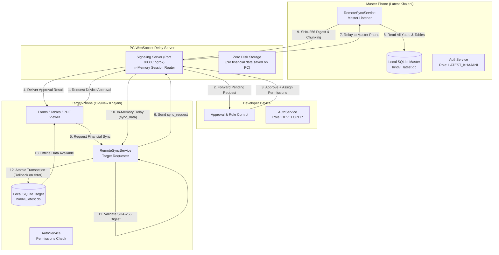
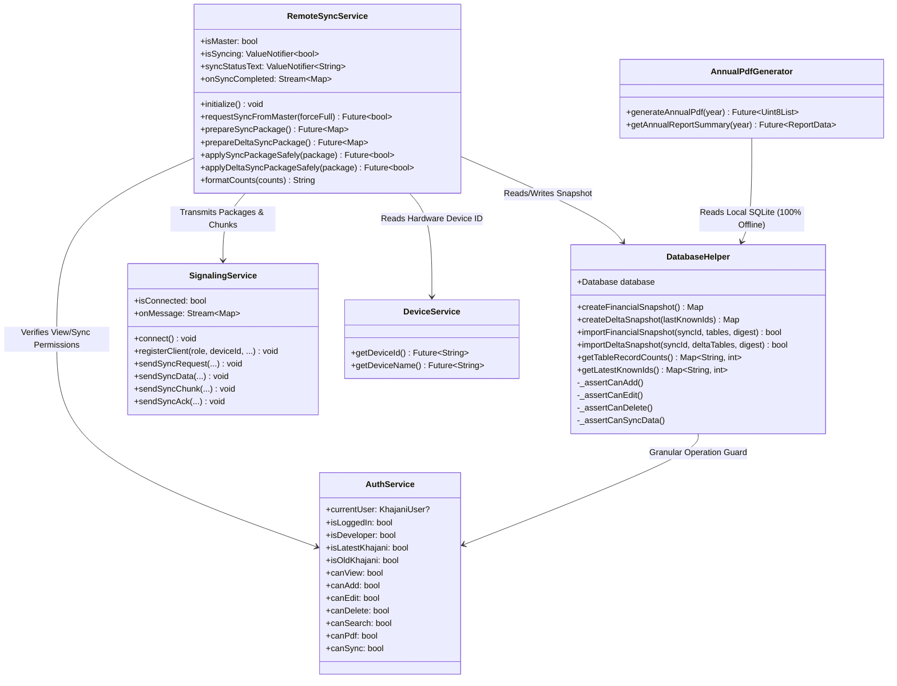
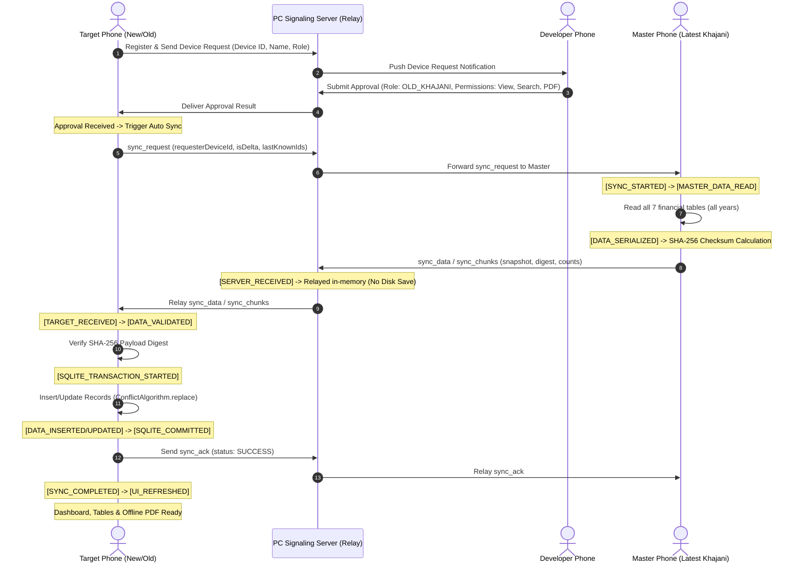
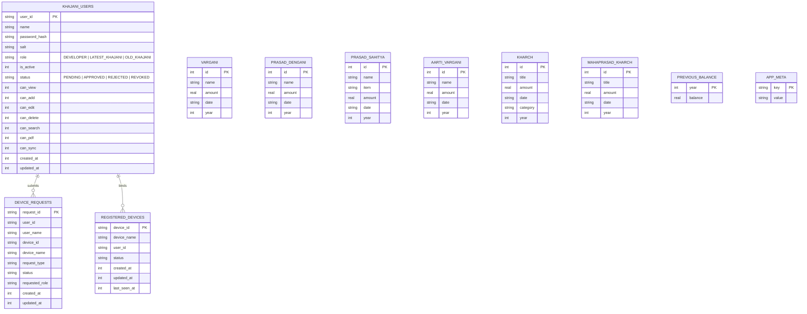

# Hindvi Swarajya Mandal Management (हिंदवी स्वराज्य मंडळ व्यवस्थापन)

A secure, offline-first Flutter application for managing Ganeshotsav / Mandal collections, contributions, market expenses, and generating Devanagari annual financial reports.

---

## 📌 Overview

Hindvi-App delivers a distributed architecture where:
- **Latest Khajani Phone = MASTER SQLite Financial Database** (`hindvi_latest.db`).
- **PC = Signaling & Communication Relay Server** (WebSocket / ngrok). **NO financial data is stored on the PC disk.**
- **Target Phones (Developer, Old Khajani, New Khajani)** = Granted granular role-based permissions (`canView`, `canSearch`, `canPdf`, `canAdd`, `canEdit`, `canDelete`, `canSync`).
- **100% Offline First** = Once synced, all tables, search functionality, and Annual Report PDF generation operate strictly offline without internet or server access.

---

## 🏗️ Low-Level Design (LLD) Diagrams

### 1. High-Level Architecture & End-to-End Data Flow



---

### 2. Component & Layer Interaction (Class / Component LLD)



---

### 3. Device Approval & Financial Sync Sequence Diagram



---

### 4. Database Schema & Entity-Relationship (ER) Diagram



---

## 🔄 Comprehensive Debug Log Pipeline

During remote synchronization, both Master and Target logs output exact actual database counts:

```text
[SYNC_STARTED] requestId=sync_1741234567 requester=D-NEW-PHONE user=khajani_02
[MASTER_DATA_READ] Vargani: 150 records, Prasad Dengani: 40 records, Prasad Sahitya: 15 records, Aarti Vargani: 10 records, Kharch: 80 records, Mahaprasad Kharch: 25 records, Previous Balance: 5 records
[DATA_SERIALIZED] Vargani: 150 records, Prasad Dengani: 40 records, Kharch: 80 records...
[DATA_SENT] to=D-NEW-PHONE, Vargani: 150 records...
[SERVER_RECEIVED] from=D-MASTER to=D-NEW-PHONE (Relaying in-memory without disk save)
[TARGET_RECEIVED] from=D-MASTER, Vargani: 150 records...
[DATA_VALIDATED] Vargani: 150 records...
[SQLITE_TRANSACTION_STARTED] Vargani: 150 records...
[DATA_INSERTED/UPDATED] Vargani: 150 records, Prasad Dengani: 40 records, Kharch: 80 records...
[SQLITE_COMMITTED] Vargani: 150 records, Prasad Dengani: 40 records, Kharch: 80 records...
[SYNC_COMPLETED] Vargani: 150 records, Prasad Dengani: 40 records, Kharch: 80 records...
[UI_REFRESHED] Vargani: 150 records, Prasad Dengani: 40 records, Kharch: 80 records...
```

---

## 🔒 Security & Data Integrity Guarantees

1. **Transaction Safety & Rollback:**
   - Any corruption or network interruption during sync aborts the atomic SQLite transaction. The existing local database remains unaltered.
2. **Duplicate Prevention:**
   - Database operations use `ConflictAlgorithm.replace` with original primary keys preserved, ensuring idempotent syncs.
3. **Chunking Mechanism:**
   - Large database packages are broken into 32 KB chunks to operate smoothly across restrictive WebSocket connections and ngrok tunnels.
4. **Offline First:**
   - Internet/server connectivity is required only during the sync operation. Once saved in local SQLite, table viewing, Marathi search, and annual report PDF generation function completely offline.
5. **Layered Authorization:**
   - `OLD_KHAJANI` accounts with read-only permissions have Add/Edit/Delete blocked at both the UI level and the `DatabaseHelper` repository layer (`_assertCanAdd()`, `_assertCanEdit()`, `_assertCanDelete()`).

---

## 🚀 Running the Server & Application

### 1. Start the PC Signaling Server

Using the provided batch scripts:
```cmd
"Start Server.cmd"
```
Or run directly using Dart:
```sh
dart run server/signaling_server.dart
```
Or run using Python:
```sh
python server/signaling_server.py
```

### 2. Run the Flutter App

```sh
flutter pub get
flutter run
```

### 3. Run Quality & Test Suite

Verify all 118 unit, widget, and end-to-end sync tests:
```sh
flutter analyze
flutter test
```

---

## 📁 Storage Directory Structure (Android)

- **Active Database:** `/storage/emulated/0/हिंदवी/hindvi_latest.db`
- **Recovery & Backup:** `/storage/emulated/0/हिंदवी/Old/`
