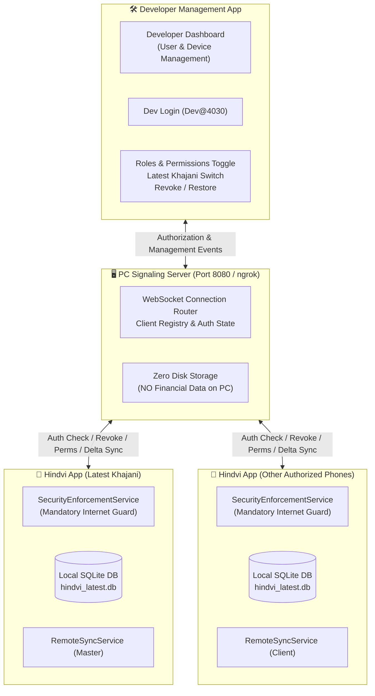
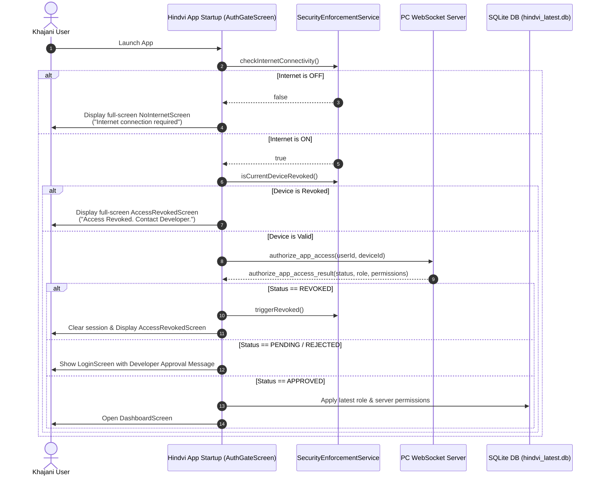
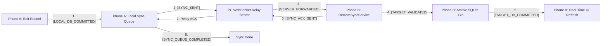

# Hindvi Swarajya Mandal Management (हिंदवी स्वराज्य मंडळ व्यवस्थापन)

A high-security, distributed architecture for managing Ganeshotsav / Mandal collections, contributions, market expenses, and generating Devanagari annual financial reports with two-way real-time delta synchronization across authorized devices, managed via an independent Developer Management App and PC Signaling Relay Server.

---

## 📌 Architecture Overview

The system is partitioned into two independent applications communicating via a signaling server:

1. 🛠️ **Developer Management App (`developer_app/`)**
   - Pure administrative application for Developer control.
   - **Login**: Developer credentials (`Developer` / secure salted SHA-256 hash).
   - **User & Device Management**: Approve, reject, revoke, or restore user accounts and unique hardware-backed device IDs.
   - **Roles**: `DEVELOPER`, `LATEST_KHAJANI`, `OLD_KHAJANI`.
   - **Granular Permissions**: Independent toggling of `VIEW`, `ADD`, `EDIT`, `DELETE`, `SEARCH`, `PDF`, `KHAJANI_MANAGEMENT`, and `SYNC`.
   - **Latest Khajani Designation**: Designate which phone/account is currently the active Latest Khajani with automatic role demotion of predecessors.
   - **Self-Protection**: Developer account cannot be revoked or deleted.
   - **Zero Financial Data**: Developer Management App contains **no financial tables**, **no SQLite database**, and **no financial business logic**.

2. 📱 **Hindvi App — Financial / Khajani App (`lib/`)**
   - The primary Mandal financial app containing **strictly user-side functionality**:
     - Login, Registration & Approval status checking
     - User's assigned role & effective granular permissions display
     - **Vargani**, **Prasad Dengani**, **Prasad Sahitya**, **Aarti Vargani**
     - **2025 Kharch**, **Mahaprasad Kharch**, **Search**, **Annual Report PDF generation**
     - Two-way Delta Synchronization across authorized phones
     - Settings (Mandal Data Transfer, Backup, Restore, Recovery Data, App Updates, Device ID, Server config, Logout)
   - **Complete Removal of Developer Controls**:
     - The old `"खजानी व्यवस्थापन"` Developer Control screen, routes, and Settings section have been completely removed.
     - User management, device approvals, role/permission management, and revocation controls are not present or accessible in this app.
     - Developer management code paths throw explicit security errors to prevent unauthorized execution.
     - Hindvi App securely receives status, roles, permissions, and revocation from the PC WebSocket server without providing management controls.
   - All 7 financial tables preserved in local SQLite (`hindvi_latest.db`).

3. 🖥️ **PC WebSocket Signaling Server (`server/`)**
   - In-memory WebSocket communication & authorization relay (Port 8080 / ngrok).
   - **Zero Financial Data on PC**: PC stores no financial records or SQLite database.
   - Manages connection routing, registration approvals, permissions sync, authorization queries, and real-time delta sync message forwarding.

---

## 🔐 Mandatory Security & Authorization Architecture

### 1. Mandatory Internet Access (No Internet = No App Access)
The Hindvi App strictly requires an active Internet connection to function:
- **Startup Check**: On app launch, the app tests Internet connectivity via DNS resolution (`dns.google` / `google.com`).
- **Offline Full-Screen Lockout**: If Internet is OFF, the app presents a blocking full-screen `NoInternetScreen`:
  > **"Internet connection required"**  
  > **"Please turn on Internet to continue."**  
  > *"सुरक्षा नियम: अनिवार्य इंटरनेट प्रवेश"*
- **Strict Lockdown**: When offline, the app strictly forbids Login, Dashboard, Vargani, Prasad, Kharch, PDF, Search, Sync, or ANY local SQLite financial read/write operations.

### 2. Server Authorization Before App Access
Once Internet is verified:
1. App establishes connection with the PC WebSocket server.
2. Authenticates using `userId` + `deviceId` + session token via `authorize_app_access`.
3. Server fetches the latest account status, device status, role, and granular permissions from persistent storage.
4. Latest roles and permissions are dynamically applied.
5. **Only if status is `APPROVED` / `ACTIVE`, the Dashboard is opened.**
6. The app never trusts stale local session flags or locally stored permissions alone.

### 3. Instant Device Revocation & Lockout
If Developer revokes a device from Developer Management App:
1. `Developer App` $\rightarrow$ `PC WebSocket Server` $\rightarrow$ Target `deviceId` $\rightarrow$ Hindvi App receives `REVOKED` event.
2. Hindvi App immediately clears session, wipes Keep Me Logged In state, terminates Dashboard, and displays full-screen `AccessRevokedScreen`:
   > **"Access Revoked. Contact Developer."**  
   > *"प्रवेश रद्द केला आहे. कृपया डेव्हलपरशी संपर्क साधा."*
3. All financial screens, PDF generation, database transactions, and login attempts are strictly blocked.
4. **Data Persistence Guarantee**: Revocation locks device access but **never deletes** the local SQLite financial database on the phone.

### 4. Dynamic Permission Enforcement
- Permissions (`VIEW`, `ADD`, `EDIT`, `DELETE`, `SEARCH`, `PDF`, `KHAJANI_MANAGEMENT`, `SYNC`) are governed by the server.
- If Developer adjusts permissions (e.g. revoking `ADD` or `EDIT`), Hindvi App updates permissions immediately.
- Enforced at startup, login, resume, dashboard screen entry, and database/service transaction layer.

---

## 🏗️ Architecture & Security Diagrams

### 1. System Communication Architecture



---

### 2. Startup & Security Enforcement Flow



---

### 3. Two-Way Financial Delta Sync Pipeline



---

## 📊 Complete Test Suites & Verification

### 1. Hindvi App (`hindvi_app`) — 145 Tests Passing (100%)
- **`test/mandatory_internet_security_test.dart` (14 Tests)**:
  - Internet OFF startup blocks access and shows `NoInternetScreen`.
  - Offline financial operations throw `StateError` with mandatory requirement message.
  - Server authorization `APPROVED` unlocks app access.
  - Server authorization `REVOKED` clears session, logs out, and locks out app.
  - Local SQLite financial data preserved across revocation.
  - Dynamic server permission changes immediately restrict respective actions.
  - Developer role bypasses regular operational restrictions.
- **`test/financial_data_sync_test.dart` (15 Tests)**:
  - Two-way delta sync across all 7 financial tables.
  - Deterministic conflict resolution (`version` $\rightarrow$ `changedAt` $\rightarrow$ `deviceId`).
  - Tombstone deletion sync and idempotency duplicate rejection.
- **`test/remote_financial_sync_test.dart` (14 Tests)**:
  - Initial snapshot hydration with SHA-256 payload integrity.
  - Marathi text preservation, search filtering, and annual report balances.
- **`test/khajani_auth_test.dart` (65 Tests)**:
  - Role management, approval workflows, and granular permission enforcement.
- **`test/settings_test.dart` & `test/update_test.dart` (37 Tests)**:
  - Storage safety, Material 3 UI, and blocking mandatory updates.
- **`test/widget_test.dart` (2 Tests)**:
  - Full dashboard workflows and settings integration.

### 2. Developer App (`developer_app`) — 17 Tests Passing (100%)
- Developer login authentication with salted SHA-256 hashing (`Dev@4030`).
- Self-protection: Developer account cannot be revoked or deleted.
- Same-name user registration with distinct unique `userId`s and `deviceId`s.
- Device revocation and restoration lifecycle.
- Granular permission configuration and toggles.
- Latest Khajani promotion and automatic predecessor demotion.
- Architectural separation: 0 financial tables, 0 SQLite files, and 0 `sqflite` dependency.

---

## 🚀 Running the System

### 1. Start the PC Signaling Server
Using the provided launcher:
```cmd
"Start Server.cmd"
```
Or with Dart directly:
```sh
dart run server/signaling_server.dart
```
Or with Python:
```sh
python server/signaling_server.py
```

### 2. Run Hindvi App
```sh
flutter pub get
flutter run
```

### 3. Run Developer Management App
```sh
cd developer_app
flutter pub get
flutter run
```

### 4. Run Test Verification Suites
```sh
# Test Hindvi App
flutter test

# Test Developer App
cd developer_app
flutter test
```

---

## 📁 Storage Directory Structure (Android)

- **Active Database**: `/storage/emulated/0/हिंदवी/hindvi_latest.db`
- **Recovery & Backup**: `/storage/emulated/0/हिंदवी/Old/`
- **Hardware Device ID**: `/storage/emulated/0/हिंदवी/.device_id`
