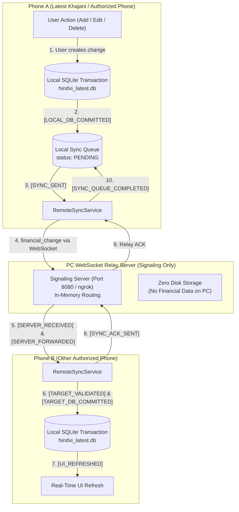
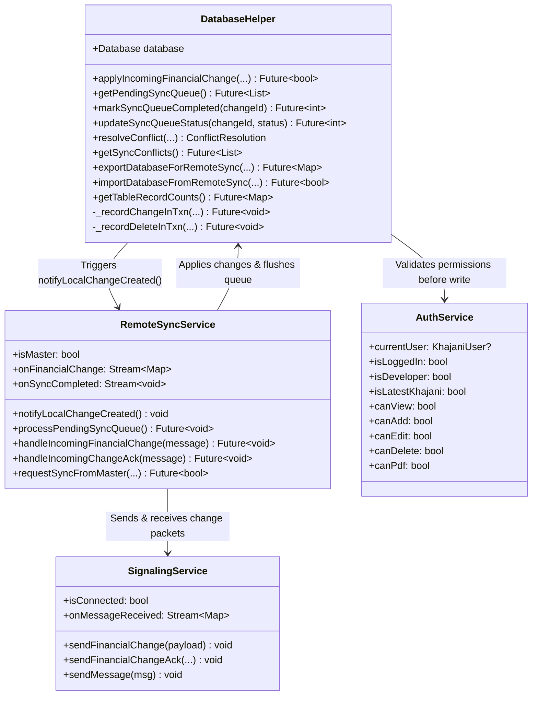
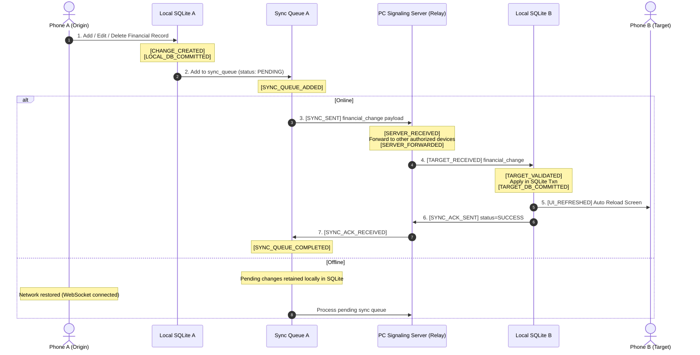

# Hindvi Swarajya Mandal Management (हिंदवी स्वराज्य मंडळ व्यवस्थापन)

A secure, offline-first Flutter application for managing Ganeshotsav / Mandal collections, contributions, market expenses, and generating Devanagari annual financial reports with two-way real-time and offline synchronization across authorized devices.

---

## 📌 Overview

Hindvi-App delivers a distributed, offline-first architecture where:
- **Phone Local SQLite Databases (`hindvi_latest.db`)**: Every phone holds its own complete local SQLite database.
- **PC = WebSocket Communication & Signaling Relay Server (Port 8080 / ngrok)**: **NO financial data is stored on the PC disk.** The PC serves exclusively as a signaling router, connection manager, and message relay.
- **Two-Way Financial Synchronization (Two-Way Delta Sync)**: Financial changes (Add/Edit/Delete) created on the Latest Khajani phone synchronize in real time to all authorized phones. Conversely, allowed changes made on authorized phones (with developer-granted Edit permissions) synchronize back to the Latest Khajani phone and all other authorized phones.
- **100% Offline-First**: When a phone is offline, changes are committed to the local SQLite database in an atomic transaction and recorded in the local `sync_queue`. Once internet connectivity is restored, pending changes automatically flush through the WebSocket relay.
- **All 7 Financial Tables Synchronized Across All Years**:
  1. `vargani` (वर्गणी)
  2. `prasad_dengani` (प्रसाद देणगी)
  3. `prasad_sahitya` (प्रसाद साहित्य)
  4. `aarti_vargani` (आरती वर्गणी)
  5. `kharch` (खर्च)
  6. `mahaprasad_kharch` (महाप्रसाद खर्च)
  7. `previous_balance` (मागील शिल्लक)
- **Deterministic Conflict Handling**: Automatic and deterministic resolution rule (`version` $\rightarrow$ `changedAt` $\rightarrow$ `deviceId`), with full audit trail logging in `sync_conflicts`.
- **Tombstone-Based Delete Sync**: Deleting a record updates `sync_tombstones` to prevent resurrecting deleted records during subsequent synchronizations.
- **Granular Role-Based Permissions**: Developer approves devices with specific capabilities (`canView`, `canSearch`, `canPdf`, `canAdd`, `canEdit`, `canDelete`, `canSync`).

---

## 🏗️ Low-Level Design (LLD) Diagrams

### 1. High-Level Architecture & Two-Way Data Flow



---

### 2. Component & Layer Interaction (Class / Component LLD)



---

### 3. Real-Time Two-Way Sync Sequence Diagram



---

### 4. Database Schema & Entity-Relationship (ER) Diagram

```mermaid
erDiagram
    KHAJANI_USERS {
        string user_id PK
        string name
        string password_hash
        string salt
        string role
        int is_active
        string status
        int can_view
        int can_add
        int can_edit
        int can_delete
        int can_search
        int can_pdf
        int can_sync
    }

    VARGANI {
        int id PK
        string name
        real amount
        string date
        int year
    }

    PRASAD_DENGANI {
        int id PK
        string name
        real amount
        string date
        int year
    }

    PRASAD_SAHITYA {
        int id PK
        string name
        string item
        real amount
        string date
        int year
    }

    AARTI_VARGANI {
        int id PK
        string name
        real amount
        string date
        int year
    }

    KHARCH {
        int id PK
        string title
        real amount
        string date
        string category
        int year
    }

    MAHAPRASAD_KHARCH {
        int id PK
        string title
        real amount
        string date
        int year
    }

    PREVIOUS_BALANCE {
        int year PK
        real balance
    }

    SYNC_QUEUE {
        string change_id PK
        string table_name
        string record_id
        string operation
        int version
        int changed_at
        string status
        int retry_count
        string record_data
    }

    SYNC_CHANGE_LOG {
        string change_id PK
        string table_name
        string record_id
        string operation
        int version
        int changed_at
        string device_id
        string user_id
    }

    SYNC_RECEIVED_CHANGES {
        string change_id PK
        string table_name
        string record_id
        int received_at
        string from_device_id
    }

    SYNC_TOMBSTONES {
        string table_name
        string record_id
        int deleted_at
        string device_id
    }

    SYNC_RECORD_VERSIONS {
        string table_name
        string record_id
        int version
        int updated_at
        string device_id
    }

    SYNC_CONFLICTS {
        string change_id
        string table_name
        string record_id
        string resolution
        string reason
        int resolved_at
    }
```



---

## 🔄 Comprehensive Debug Log Pipeline

The following exact debug log sequence is guaranteed throughout the system:

```text
[CHANGE_CREATED] changeId=CHG_... table=vargani op=UPDATE recordId=1
[LOCAL_DB_COMMITTED] changeId=CHG_... table=vargani recordId=1
[SYNC_QUEUE_ADDED] changeId=CHG_... table=vargani recordId=1 status=PENDING
[SYNC_SENT] changeId=CHG_... table=vargani recordId=1 to=SERVER
[SERVER_RECEIVED] type=financial_change from=DEV_PHONE_A table=vargani recordId=1 op=UPDATE
[SERVER_FORWARDED] to=all authorized devices changeId=CHG_...
[TARGET_RECEIVED] changeId=CHG_... table=vargani recordId=1
[TARGET_VALIDATED] changeId=CHG_... table=vargani
[TARGET_DB_COMMITTED] changeId=CHG_... table=vargani recordId=1
[SYNC_ACK_SENT] changeId=CHG_... to=DEV_PHONE_A
[SYNC_ACK_RECEIVED] changeId=CHG_... status=SUCCESS
[SYNC_QUEUE_COMPLETED] changeId=CHG_...
[UI_REFRESHED] table=vargani recordId=1 operation=UPDATE
```

---

## 🔒 Security, Conflict & Data Integrity Guarantees

1. **Deterministic Conflict Resolution**:
   - If two phones concurrently modify the same record, resolution follows:
     1. Highest `version` wins.
     2. If versions are equal, newest `changedAt` timestamp wins.
     3. If timestamps are equal, alphabetical tiebreaker on `deviceId` wins.
   - All conflicts are recorded in the `sync_conflicts` table for auditing.
2. **Transaction Safety & Rollback**:
   - Every incoming change is applied inside an atomic SQLite transaction (`db.transaction`). If validation fails, changes are completely rolled back without corrupting the local database.
3. **Delete Sync with Tombstones**:
   - Deletions are executed physically on the data table and tracked in `sync_tombstones`. Future incoming inserts for a tombstoned record are rejected to prevent resurrection.
4. **Idempotency & Duplicate Prevention**:
   - Incoming change IDs are logged in `sync_received_changes`. Re-transmitted packets are acknowledged without creating duplicate records.
5. **No Infinite Ping-Pong Loops**:
   - Changes applied via incoming sync are never added back into `sync_queue`.
6. **Zero PC Data Storage**:
   - PC WebSocket server never saves financial records to disk or database.

---

## 🚀 Running the Server & Application

### 1. Start the PC Signaling Server

Using the provided batch scripts:
```cmd
"Start Server.cmd"
```
Or run directly using Dart:
```sh
dart run server/signaling_server.dart
```
Or run using Python:
```sh
python server/signaling_server.py
```

### 2. Run the Flutter App

```sh
flutter pub get
flutter run
```

### 3. Run Quality & Test Suite

Verify all 133 unit, widget, and financial data sync tests:
```sh
flutter analyze --no-pub
flutter test
```

---

## 📁 Storage Directory Structure (Android)

- **Active Database:** `/storage/emulated/0/हिंदवी/hindvi_latest.db`
- **Recovery & Backup:** `/storage/emulated/0/हिंदवी/Old/`
